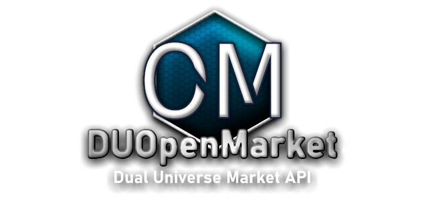

  

# DUOpenMarket
Open Source Third-Party Market API for Dual Universe

## Installation Instructions
Download the DUOpenMarket Client, and place the EXE anywhere you wish. (any non-admin protected directory)
It is at least recommended to create a subfolder for the DUOM client to reside in, as it will create several files of its own, in the same directory as the EXE.

# F.A.Q.
For the full list of questions and answers, please see the project's website.

## What is the DUOpenMarket Desktop Client?
The DUOpenMarket Desktop client actively scrapes your logfiles while you play Dual Universe. It sends the market data for any items you search for ingame, to our servers, where we can share it with others who may not be logged into the game. We strongly encourage players to keep the DUOpenMarket Desktop client open in the background while they play the game normally. If everyone did that, our database would always be up to date.

## What information does DUOpenMarket collect?
The DUOpenMarket Desktop client ONLY accesses logfiles created by Dual Universe. Our servers occasionally collect IP information when a request is made, to help us improve the quality of our service and eliminate bots. We do not collect any personally identifiable information or other analytical data about our users, or their devices.

## Does the DUOpenMarket Client violate NovaQuark's TOS?
Simply put, NO. DUOpenMarket is perfectly legal to use and infact there are many tools that predate this one, which do similar things. The client only reads from log files which are created by Dual Universe. It does not read game files. It does not modify, update, move, or delete, any files other than its own. 

## Where's the server code?
That's the one piece of this project that isn't public. Having the code to your server freely accessible on the web is not generally a great idea, unless that code has hundreds of individuals meticulously scrutinizing its security. That hasn't happened yet, so, no server code. Sorry.

You can, however, find the documentation to the API here; https://www.duopenmarket.com/documentation.php
Which will allow you to interact with the server directly, as long as you follow the rules listed on that page (Specifically the Considerate Use section)

## Planned features/improvements (In no particular order)

Add a "Resource Manager" panel or window, which can automatically update/restore/backup user scripts, holograms, and sounds.

Add item statistics to the right side of window, below item name. Requires a neat way to look them up from a file. And the file. RegEx <3

Add a visual, interactive point-graph of the current orders for a given item.

Add Historical data retrieval commands to the API, and use this data to render visual graphs on the clientside.

Add metastatistics about the overall health and throughput of the economy to the API, and graph them.

Add profit-margin and yeild-margin calculators for industry, which use the current market prices and can factor in talents.

Add fuel/warp-cost and transportation-related calculators using current fuel prices, factoring for talents.

Add an interface for tracking relationships bewteen player accounts and discord ID's, for the purpose of providing a "reputation" for a given player.
